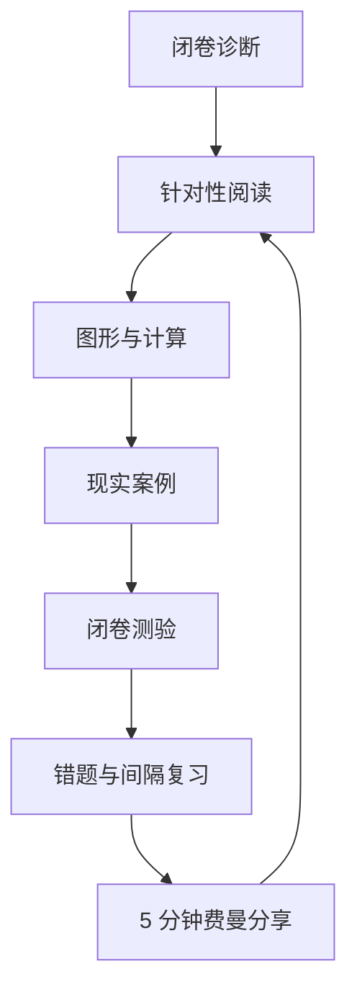

# AI 辅助微观经济学系统学习与应用实践

`microeconomicsLearning` 是一个公开的单体学习仓库，用于持续记录我借助 AI 系统学习微观经济学的全过程。

本仓库参考 [`localization-mapping-learning`](https://github.com/XiaoJiNu/localization-mapping-learning) 的方法：**先诊断、后规划；以问题驱动学习；用图形、计算、案例、闭卷测验和间隔复习形成可验证证据；不把“看懂了”当成“掌握了”。**

主要教材为：N. 格里高利·曼昆《经济学原理（第 8 版）：微观经济学分册》。教材负责提供主线、术语与经典模型；仓库负责把教材内容转化为诊断题、学习笔记、图形推理、现实案例、错题记录和每日 5 分钟分享。

> 本仓库不上传教材 PDF，也不大段复制教材正文。教材仅作为个人学习资料使用，仓库只保留自编笔记、页码索引和必要的出处说明。

## 当前进度

当前版本：**v0.1，仓库基线已建立，第一次闭卷诊断正在进行。**

从这里开始：

1. 不查资料，回答 [`diagnostic_questions.md`](docs/00_learning_system/diagnostic_questions.md) 的第 1 题；
2. 重点写出推理过程，不只给结论；
3. 将回答发回当前对话，由 AI 以“考官”身份追问和评估；
4. 诊断完成后生成个人能力画像，再进入[单元 01](docs/units/01_economic_thinking/README.md)；
5. 每天完成 60 分钟学习，并产出一份 5 分钟可读、可讲的费曼小结。

详细状态见[学习进度表](docs/00_learning_system/progress.md)，完整阶段安排见 [ROADMAP](ROADMAP.md)。

## 我希望练成的五种能力

1. **概念能力**：能用自己的话解释稀缺性、机会成本、边际、弹性、剩余、外部性等核心概念；
2. **模型能力**：能画出并解释供求、生产可能性边界、成本曲线、市场结构和消费者选择模型；
3. **计算能力**：能独立完成机会成本、弹性、剩余、税收归宿、利润最大化等基础计算；
4. **因果与证据能力**：能区分相关与因果、实证与规范、曲线移动与沿曲线移动，并检查模型假设；
5. **应用与判断能力**：能把微观经济学用于产品定价、行业竞争、公共政策和企业分析，同时说明结论的适用边界。

## 每日学习节奏：60 分钟学习 + 5 分钟分享

| 阶段 | 用时 | 动作 | 必须留下的证据 |
|---|---:|---|---|
| 主动回忆 | 5 分钟 | 合上资料回答昨天的一个问题 | 一段闭卷回答 |
| 教材阅读 | 20 分钟 | 只读当天指定范围 | 三个核心结论 |
| 图形或计算 | 15 分钟 | 画图、推导或完成一个小计算 | 手写过程或 Markdown 过程 |
| 现实应用 | 10 分钟 | 分析一个生活、产品、行业或政策案例 | “变量—机制—结果—边界” |
| 小测与纠错 | 10 分钟 | 闭卷答题并更新错误索引 | 一条错误及修正证据 |
| 费曼分享 | 5 分钟 | 用非专业语言讲给别人听 | [`daily/`](daily/) 中的一篇小结 |

每日小结不是教材摘要，而是一份可直接分享的短讲稿：从一个问题开场，只讲一个核心观点，用一个例子解释，并明确常见误区和适用边界。

## 每个单元的固定闭环



每个单元尽量形成同一组证据：核心问题、学习笔记、图形或推导、案例分析、闭卷测验、错误记录、一页速查表和每日分享。

## 仓库结构

```text
microeconomicsLearning/
├── docs/
│   ├── 00_learning_system/   # 学习地图、诊断、进度、复习与错误索引
│   └── units/                # 按教材章节逐步创建的学习单元
├── daily/                    # 每天 5 分钟可读、可分享的小结
├── references/               # 教材与外部资料索引，不存受版权保护原文
├── templates/                # 每日学习与费曼分享模板
├── README.md
└── ROADMAP.md
```

初始版本只创建正在使用的学习系统和单元 01。后续单元在真正开始时加入，避免提前堆积空目录。

## 关于股票、黄金与现实应用

微观经济学能帮助分析消费者行为、企业成本、定价能力、竞争格局、行业进入壁垒和政策影响，因此对企业与行业研究很有价值；但它**不能单独预测股票或黄金的短期价格**。仓库中的投资应用会明确区分：

- 教材直接支持的微观机制；
- 基于机制做出的现实推断；
- 需要宏观经济学、金融学、会计或数据验证才能回答的问题。

## 学习纪律

- 诊断和测验先闭卷作答，再看笔记；
- 公式必须解释变量、单位、假设和经济含义；
- 图形必须说明横纵轴、曲线为何移动以及均衡如何变化；
- 现实案例必须区分事实、推断与价值判断；
- 即时答对不算掌握，还要通过第 1、3、7、14、30 天主动复习再次验证；
- AI 的答案不是最终证据，自己的推导、图形、计算、案例和复述才是。
