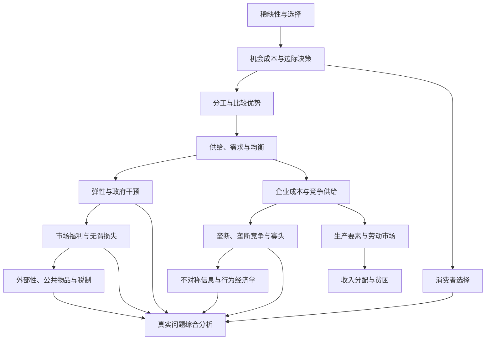

# 微观经济学学习地图

本页只回答两个问题：

1. 微观经济学需要学习哪些单元；
2. 应按什么顺序形成可验证能力。

具体执行某个单元时，直接进入[学习单元目录](../units/README.md)。当前材料已经就绪的是[单元 01：经济学思维](../units/01_economic_thinking/README.md)。

## 当前唯一下一步

第一次全局诊断尚未完成。先从[诊断第 1 题](diagnostic_questions.md)开始；完成全部诊断并形成[诊断报告](diagnostic_report.md)后，再按单元 01 主页开始学习。

## 五级能力阶梯

| 等级 | 本阶段应具备的能力 | 最小过关证据 |
|---|---|---|
| 1：识别与复述 | 能用自己的话解释核心术语，并给出生活例子 | 闭卷解释，不照抄教材 |
| 2：图形与计算 | 能独立画基础模型、完成计算并写清单位 | PPF、供求图、成本图或完整计算过程 |
| 3：机制与应用 | 面对新事件能说明谁的约束改变、哪条关系变化、结果为何改变 | “变量—机制—结果—边界”的新案例 |
| 4：批判与诊断 | 能检查假设，区分相关与因果、实证与规范，并发现遗漏变量 | 一个反例、替代解释或政策副作用分析 |
| 5：综合决策 | 能组合多个模型比较不同方案对各主体和福利的影响 | 有图形、计算、证据需求和不确定性的分析报告 |

五级阶梯描述能力深度，十个单元描述学习内容和先后顺序。不能因为“看懂了”就自动升级。

## 知识结构

## 十个教材单元

| 单元 | 教材章节 | 核心问题 | 第一轮关键证据 |
|---:|---|---|---|
| 01 经济学思维 | 第 1～2 章 | 稀缺条件下怎样选择，模型和证据怎样帮助判断？ | 机会成本分析、PPF、因果辨析、两次费曼分享 |
| 02 分工、贸易与市场 | 第 3～4 章 | 为什么比较优势带来贸易，价格怎样协调市场？ | 比较优势计算、供求均衡图 |
| 03 弹性与政府干预 | 第 5～6 章 | 谁对价格更敏感，价格控制和税收怎样改变结果？ | 中点法弹性、政策图形 |
| 04 市场福利、税收与贸易 | 第 7～9 章 | 怎样衡量交易收益、税收代价和贸易得失？ | 消费者／生产者剩余、无谓损失 |
| 05 公共部门经济学 | 第 10～12 章 | 市场何时失灵，政府政策如何取舍？ | 外部性或公共物品案例、政策比较 |
| 06 成本与竞争企业 | 第 13～14 章 | 企业成本怎样形成，何时生产、停业或退出？ | 成本曲线、利润最大化判断 |
| 07 市场势力与策略互动 | 第 15～17 章 | 垄断、垄断竞争和寡头为什么不同？ | 市场结构比较、博弈案例 |
| 08 劳动、收入与分配 | 第 18～20 章 | 工资和收入差异怎样形成，平等政策有什么代价？ | 劳动市场图、实证与规范分析 |
| 09 消费者选择 | 第 21 章 | 预算约束和偏好怎样共同决定选择？ | 预算线、无差异曲线、收入／替代效应 |
| 10 微观经济学前沿 | 第 22 章 | 信息、政治过程和非完全理性怎样改变基础模型？ | 逆向选择、道德风险或行为偏差案例 |

## 20 小时第一轮

第一轮由十个单元各自的两天学习组成：

- 每个单元 Day A 学习 60 分钟；
- 每个单元 Day B 验证 60 分钟；
- 每天另做 5 分钟费曼分享；
- D0、D1、D3、D7、D14、D30 复习另计。

20 小时表示“第一次建立知识地图并形成基础证据”，不表示 20 小时后已经完全掌握微观经济学。

## 每个单元固定执行六步

进入具体单元后，默认采用：

1. **开始**：复制工作簿并确认目标；
2. **完整学习**：从头到尾学习 `lesson.md`；
3. **主线重建**：合上课程连接关键概念；
4. **独立练习**：完成图形、计算或推导；
5. **现实应用**：分析一个真实或新案例；
6. **统一考核与归档**：最后终测、费曼输出和复习安排。

具体打开哪些文件、每天怎样分配时间，见[两天／两小时单元学习流程](unit_workflow_2h.md)。

## 单元之间怎样推进

- 首次证据齐全并达到当天标准后，状态进入 `待复习`；
- 安排好延迟复习后可以开始下一单元，不必等待 30 天；
- 后续单元暴露前置缺口时，只回补对应能力，不把整个路线清零；
- 同一根因错误重复出现时，写入[全局错误索引](error_index.md)；
- 阶段结束后用新题全局复诊，再调整后续顺序。

## 掌握判据

一个单元只有同时满足以下条件，才能标记为 `已掌握`：

- 主课程、练习、案例和终测证据齐全；
- 闭卷终测达到 80% 以上，核心题正确；
- 能独立画图或完成计算；
- 能分析一个没有见过的新案例；
- 能指出至少一个模型假设或适用边界；
- D7 或更晚的复习仍通过；
- 已完成对应的五分钟费曼输出；
- 同一根因错误没有持续复发。

“读完”“看懂”“AI 解释过”都不单独构成掌握证据。
