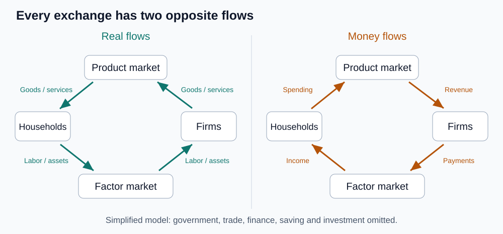
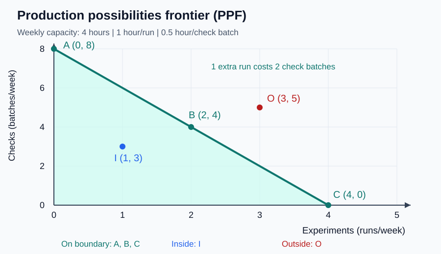

# 05｜钱流向哪里，资源又允许生产多少？

**核心问题：怎样用图分别表达主体之间的联系，以及同一批资源能实现的产出组合？** 学完应能读出循环流向图的方向，画出生产可能性边界并算出机会成本。核心阅读与即时练习约 10–15 分钟；迁移题自选。

先修回顾：模型为了回答问题而省略细节。本课两张图回答不同问题，不能因为都叫“经济模型”就互相替代。

## 读图需要的术语

| 中文 | 原始英文 | 缩写与含义 |
|---|---|---|
| 循环流向图 | Circular-flow Diagram | 无通用缩写，不使用容易与计算流体力学混淆的 CFD。表现主体间实物与货币流动。 |
| 生产要素 | Factors of Production | 无通用缩写。生产商品和服务所使用的投入，例如劳动、土地和设备。 |
| 生产可能性边界 | Production Possibilities Frontier | PPF。给定资源与技术时，两种产出所能达到的最大组合边界。 |
| 生产效率 | Productive Efficiency | 无通用缩写。在现有资源和技术下，增加一种产出必须减少另一种产出。 |
| 机会成本 | Opportunity Cost | OC 为常见教学简写。本课用少生产的另一种产品来计量。 |

## 先追踪一杯咖啡背后的两种流动

简化经济中只有家庭和企业。家庭在产品市场购买咖啡，在生产要素市场提供劳动和自有设备的使用服务；企业购买这些投入，并生产和出售咖啡。家庭既可能是顾客，也可能是劳动者或资产所有者，并非每个人永远只有一种身份。

图中文字对照：Households＝家庭，Firms＝企业，Product market＝产品市场，Factor market＝要素市场；Goods / services＝商品与服务，Labor / assets＝劳动和资产投入。Spending / Revenue 对应消费支出与销售收入，Payments / Income 对应要素支付与要素收入。

左图追踪实物流：劳动等投入从家庭经过要素市场流向企业，商品与服务从企业经过产品市场流向家庭。右图追踪货币流：工资等要素收入流向家庭，消费支出流向企业。注意每一项交易都有对应的反向流动：企业付工资，获得劳动服务；家庭付咖啡钱，获得咖啡。

这张图帮助你区分收入和支出的位置，却没有说明收入分配是否公平。它还主动省略了政府、对外贸易、金融机构和储蓄投资细节。因此不能因为图中画了循环，就推断“家庭拿到的工资必须立刻全部消费”，也不能把银行贷款误当作企业卖商品的营业收入。

## 再固定资源，问最多能做多少

一家小团队本周有 4 小时可用设备时间。一次模型实验占用 1 小时，一批数据质检占用 0.5 小时，二者互斥使用设备；人员、质量标准、技术和设备状态都不变。这是自编的教学情形。

设 $x$ 为本周完成的模型实验次数，$y$ 为本周完成的数据质检批数。资源约束为：

$$
x+0.5y\leq4,\qquad x\geq0,\quad y\geq0。
$$

左边各项单位都是小时：次数乘每次耗时，加上批数乘每批耗时，不能超过可用的 4 小时。把资源用足时：

$$
y=8-2x。
$$

在这张图上，**横轴向右是实验次数增加，纵轴向上是质检批数增加**。不要按照现实地图把纵轴想成“前方”；经济图里的轴代表数量，不代表物理方位。

图中 Experiments＝模型实验，Checks＝数据质检；On boundary＝边界上，Inside＝边界内，Outside＝边界外。图注明确：增加一次实验，需放弃两批质检。

| 组合 | 实验 x | 质检 y | 占用时间 | 含义 |
|---|---:|---:|---:|---|
| A | 0 | 8 | 4 小时 | 全部做质检，在边界上 |
| B | 2 | 4 | 4 小时 | 混合安排，在边界上 |
| C | 4 | 0 | 4 小时 | 全部做实验，在边界上 |
| I | 1 | 3 | 2.5 小时 | 图内，有 1.5 小时未使用 |
| O | 3 | 5 | 5.5 小时 | 图外，现有资源达不到 |

从 A 到 B，实验增加 2 次，质检减少 4 批，所以每增加一次实验的机会成本是 $4/2=2$ 批质检。单位是“批/次”，不是元，也不是一个没有单位的数字。直线斜率为 −2，负号表示此消彼长，绝对值 2 才是这里每次实验对应的机会成本。

## 沿边界走、向边界走、边界外移，三者不同

从 A 到 B 是重新分配已经充分使用的资源，必须付出质检减少的代价。从内部点 I 到 B，实验与质检同时增加，因为原来有资源闲置。后者不能据此否认机会成本，而是说明原来的约束还没被用满。

若设备可用时间由 4 小时增加到 5 小时，边界成为 $y=10-2x$，两个轴截距分别变成 5 次和 10 批，生产能力才真正扩大。如果仅质检速度翻倍，实验轴截距仍为 4，质检轴截距变为 16，边界是绕实验截距向外转，而不是两边都等比例平移。

本例用直线，是因为每项工作耗时固定、资源可在两种用途间按同样效率切换。现实中人和设备有不同专长，先调最适合的资源、再调不适合的资源，增加实验的机会成本可能逐步升高，这时边界常向原点外侧弯曲。边界形状来自假设，不能看到 PPF 就默认一定是直线。

边界上也不等于“这个组合最值得做”。A 与 B 都有生产效率，但哪一个更符合目标，取决于实验与质检的价值。如果质量保障比模型迭代更紧迫，全部追求实验次数并没有自动变好。资源利用和价值选择需要分别判断。

## 即时练习：先算，再画

上述团队现在有 5 小时设备时间，技术不变。组合“3 次实验、4 批质检”在哪里？从该组合再多做一次实验，至少少做几批质检？

展开答案与图形解释

占用时间为 3×1＋4×0.5＝5 小时，所以在新边界上。多一次实验需 1 小时，必须少做 1÷0.5＝2 批质检，新组合为 4 次实验、2 批质检。图上从 (3,4) 向右一格、向下两格。若只看“新边界在外面”而不计算资源，就容易误以为所有扩产都不需要取舍。

## 迁移题：休息是“低效率”吗？

某人可以工作 8 小时，却只工作 6 小时、休息 2 小时。能直接据此认定他处在低效率状态吗？

展开答案与模型边界

不能。若图中只画两种工作产出，把休息排除在目标之外，休息可能表现为没有用于这两种生产的时间；但休息本身有价值，也可能提高之后的健康与效率。需要把休息纳入可选用途或重新定义时间范围。PPF 是指定产出和资源下的模型，不能据此把所有非市场活动判为浪费。

## 一分钟复述

指着两张图说：循环图的一个实物流及其反向货币流；PPF 的横纵轴分别是什么；从内部到边界、沿边界调整、边界外移各代表什么。最后解释为什么边界上仍可能选错产出组合。

教材主题索引：第 2 章循环流向图与生产可能性边界。图形与数值为自编教学材料。

[上一课](04_models_ceteris_paribus.md) · [返回单元首页](README.md) · [下一课：事实判断和价值判断怎样分开？](06_micro_macro_positive_normative.md)

把原始答案、修正和复述卡点记入[课程工作簿](../workbook.md)。
