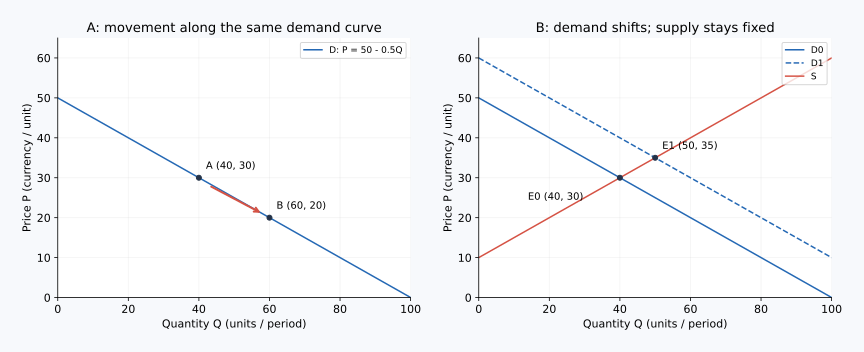

# 05｜价格没变，人们为什么也会买得更多？

**核心问题：**新闻里的收入、补贴、竞品降价，怎样变成对需求曲线的判断？学完本课，你应能先固定目标商品价格，再解释外部因素改变购买计划的机制。

核心阅读与即时题约 10–15 分钟；迁移题自选。先修回顾：自身价格改变时，通常沿已有需求曲线移动；需求曲线移动意味着同一价格下的需求量已经不同。

## 本课术语

| 中文 | English | 缩写或记号 | 解释 |
|---|---|---|---|
| 替代品 | Substitutes | 无通用缩写 | 一种商品涨价时，通常使另一种商品需求增加的商品关系。 |
| 互补品 | Complements | 无通用缩写 | 一种商品涨价时，通常使另一种商品需求减少的商品关系。 |
| 正常品 | Normal Goods | 无通用缩写 | 其他条件不变时，收入增加会使其需求增加的商品。 |
| 低档品（亦译劣等品） | Inferior Goods | 无通用缩写 | 其他条件不变时，收入增加会使其需求减少的商品；不等于劣质或不安全。 |
| 需求曲线移动 | Shift in Demand | 无通用缩写 | 除本商品价格之外的因素，使价格与需求量的完整关系改变。 |

本课用到的旧术语（需要时展开）

| 中文 | English | 缩写或记号 | 回顾解释 |
|---|---|---|---|
| 其他条件不变 | Ceteris Paribus | 无通用缩写 | 分析一个变量的作用时，暂时固定其他相关因素。 |
| 需求曲线 | Demand Curve | 图线或变量记号 `D` | 价格与需求量关系的图形表示。 |
| 供给曲线 | Supply Curve | 图线或变量记号 `S` | 价格与供给量关系的图形表示。 |
| 曲线移动 | Shift of a Curve | 无通用缩写 | 商品自身价格以外的因素改变，使整条曲线改变位置。 |

## 判方向前，必须先说清楚研究哪一个市场

“咖啡涨价导致需求减少”含混不清。如果研究的是咖啡本身，涨价通常导致咖啡需求量减少，是沿咖啡需求曲线移动；如果研究茶饮，咖啡涨价可能把消费者推向茶饮，使茶饮需求曲线右移。商品关系和所画曲线必须同时写出来。

你可以用三个连续问题整理任何事件：第一，目标商品是什么，时间范围是什么？第二，把它的价格暂时固定，买方计划是否变化？第三，变化通过哪一种机制发生？这样做类似排查模型性能变化时先固定评价集，避免把输入变化与模型自身变化混在一起。

## 用同一个数例看懂右移与左移

继续研究标准早餐。原需求为 $Q_d=300-10P$，其中 $P$ 为元/份，$Q_d$ 为份/周。附近新增办公楼，在模型中让每个价格下的每周需求都增加 60 份。新关系为：

$$
Q'_d=360-10P
$$

价格固定为 10 元时，原需求量为 200 份，新需求量为 260 份；固定为 15 元时，原来 150 份，现在 210 份。数量轴向右为增加，所以整条需求曲线右移。此处每个价格都增加相同数量是教学简化，现实曲线也可能转动或改变形状。

若办公楼撤出，导致各价格下需求量减少 40 份，则关系可写为 $Q''_d=260-10P$，在 10 元时只需求 160 份，曲线相对原来左移。注意，这里横向移动的单位是份/周，不能把“右移 60”误写成“价格上涨 60 元”。市场价格会如何变化，还需要供给曲线，不能从需求一边直接得到数值。

## 四种常见原因，逐一连接行为机制

**收入变化。**对某些人，收入增加意味着更愿意购买便利、品质或服务，于是现制早餐需求增加，它在这个人群和收入区间内属于正常品。对另一些人，收入增加会减少购买方便面、转向现制食物，方便面可能表现为劣等品。这个分类来自收入变化后的购买行为，不是对商品品质和消费者身份的评价。同一种商品可以因人群、收入区间不同而分类不同。

**相关商品价格变化。**若包子与三明治可以替代，包子涨价时，在三明治价格固定的情况下，三明治需求可能增加。如果研究打印机，墨盒是使用中的互补投入；墨盒涨价提高后续使用成本，可能减少同一售价下的打印机需求。替代与互补必须结合使用场景，不是凭商品外观判断。

**偏好和买方人数变化。**健康偏好加强，可能让同一价格下的低糖食品需求增加；办公室人数减少则可能降低周边午餐市场的需求。个体偏好变化与消费者数量变化是不同原因，却都可能移动市场需求。

**对未来的预期。**如果买方预期下月促销，一些可推迟购买的需求会移到下月，当前需求可能减少；预期未来短缺，则可能提前采购。方向依赖能否储存、是否必须立即使用。不能把“预期涨价”机械套到无法长期储存的鲜奶上。

## 容易判断过头的地方

“收入上涨，所以所有商品需求增加”忽视劣等品；“竞品价格下降，所以本商品价格必然下降”把需求冲击直接当成市场结果。后一事件首先可能让本商品需求左移，均衡价格如何调整，还依赖供给以及同期其他变化。

补贴也需要口径。若把纵轴定义为消费者实际支付价格，单纯每单补贴会改变支付价格与卖方所得价格的关系；若纵轴为卖方标价，补贴可能表现为同一标价下需求增加。两种画法可以一致，但不能一会儿用到手价，一会儿用标价。当前课程先练习不涉及价税差的收入、竞品、偏好和人数变化。

## 配图：把推理落到坐标上

左图是同一需求线上的数量变化，右图是需求线移动。此独立图例用需求 P=50−0.5Q、供给 P=10+0.5Q；需求截距由50提高到60时，均衡从(Q,P)=(40,30)变为(50,35)。D、S分别是需求和供给线标签。

图中横纵轴及完整验算见[图形读法](../visual_guide.md)。

## 即时练习

目标市场是某城市共享单车的单次使用服务。公交票价下降，共享单车单次价格不变；假设两者是替代品，其他条件不变。共享单车需求怎样变？若只是共享单车自身降价呢？

展开详细答案

公交降价使部分用户转向公交，在固定单车价格下，单车使用计划减少，单车需求曲线左移。若只改变单车自身价格，则沿原单车需求曲线移动，需求量增加。现实可能还有“骑车接驳公交”的互补关系；题目明确替代品假设才使第一问方向确定。

## 迁移题

电动汽车价格不变，汽油涨价且充电费用也涨价。能否确定电动汽车需求一定增加？

展开详细答案

不能。汽油涨价可能提高燃油车使用成本，使一部分买方转向电动车，对电动车需求产生向右的作用；充电涨价提高电动车使用成本，对其需求产生向左的作用。净效果依赖两个变化的幅度、人群驾驶里程和替代程度。这里甚至尚未讨论电动车供给，不能直接预测其最终售价。

## 一分钟复述

“先确定目标商品，再固定它的价格。收入、相关商品价格、偏好、人数与预期如果改变购买计划，就会移动需求曲线。两种原因方向相反时，要承认净效果暂时无法确定。”

[上一课](04_demand_quantity_demanded.md) · [单元首页](README.md) · [下一课：从零理解供给曲线](06_supply_quantity_supplied.md)

把原始答案、修正和复述卡点记入[课程工作簿](../workbook.md)。
