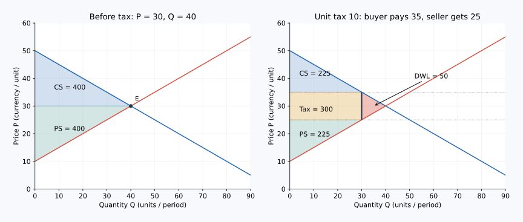

# 04｜税收拿走的钱，为什么不全是社会损失？

> 核心问题：**怎样同时计算消费者、生产者、政府和消失交易的变化？**
> 核心阅读与即时练习约10–15分钟；按理解推进，拓展可另做。所有数例均为教学虚构数据。

上一课：[03课](03_total_surplus_efficiency_equity.md) · [本单元](README.md) · 下一课：[05课](05_elasticity_tax_revenue.md)

## 先找清钱去了哪里

征税后，消费者多付、生产者少得，但其中一部分钱进入政府。这部分没有凭空消失，若只把CS和PS的下降相加，当成全部社会损失，就会把政府取得的收入漏掉。

税收还会让部分买卖退出市场，那些原本“买方愿付超过卖方成本”的交易没有发生，损失的才是本课要识别的额外部分。

## 本课术语

| 中文 | English | 常用缩写或符号 | 解释 |
|---|---|---|---|
| 无谓损失 | Deadweight Loss | DWL | 相对有效率基准，模型计入的总净收益减少 |
| 政府税收收入 | Government Tax Revenue | 无通用统一缩写；本课用 $G$ | 税额乘实际征税交易量 |
| 税收楔子 | Tax Wedge | 无通用缩写 | $P_b-P_s=t$ |
| 消费者、生产者剩余 | Consumer / Producer Surplus | CS、PS | 买方和卖方从交易得到的净收益 |
| 总剩余 | Total Surplus | TS | 本课包含 $CS+PS+G$ |

我们把政府收入每一元按一元计入福利，暂不计征管成本、公共支出产生的额外效益和分配权重。评价具体税制时，这些假设应进一步检查。

## 先重建税前税后市场

沿用需求 $Q_d=100-P_b$、供给 $Q_s=P_s-20$。无税时 $P=60$ 元、$Q=40$ 件；CS和PS各800元，TS为1600元。

征收每件20元税，联立 $P_b-P_s=20$ 和 $Q_d=Q_s$，得到 $P_b=70$ 元、$P_s=50$ 元、$Q_t=30$ 件。这里的下标 $t$ 仅表示征税后，单位仍为件/周。

## 一步一步算完整福利账

税后买方按70元购买30件，CS为：

$$CS_t=\frac12\times30\times(100-70)=450\text{元}.$$

卖方每件净得50元，PS应按这个净价算，而不是含税70元：

$$PS_t=\frac12\times30\times(50-20)=450\text{元}.$$

政府收入是矩形面积：

$$G=tQ_t=20\times30=600\text{元}.$$

所以税后TS为 $450+450+600=1500$ 元，DWL为 $1600-1500=100$ 元。

| 项目 | 无税 | 征税后 | 变化 |
|---|---:|---:|---:|
| CS | 800 | 450 | −350 |
| PS | 800 | 450 | −350 |
| 政府收入 | 0 | 600 | +600 |
| TS | 1600 | 1500 | −100 |

单位均为元/周。买卖双方共减少700元，其中600元转移给政府，100元是消失交易的净收益。不能把600元税款也再次记为社会成本，否则会重复扣除。

## 那100元损失具体是什么

第30件附近，买方WTP为70元、生产成本为50元，两者差20元；到第40件时，WTP和成本都等于60元，差额归零。第30至40件原本各能创造正净收益，却因税收楔子不再成交。

图上横轴数量向右增加、纵轴每单位价格与成本向上增加。在数量30处，需求和供给之间竖直距离为税额20元；数量从30到40这一段夹在两曲线之间的三角形，就是DWL：

$$DWL=\frac12\times t\times(Q^*-Q_t)=\frac12\times20\times10=100\text{元}.$$

这个三角形公式利用了本例线性供需。更一般的曲线应计算消失交易区间的价值减成本面积，不能默认永远是直角三角形。

## 边界：存在外部性时，税未必增加总损失

本课无税均衡已经有效率。如果生产污染损害了未参与交易的人，私人供给曲线没有计入全部社会成本，无税数量可能过多。恰当税收通过减少这些交易，可能提高社会福利。下一单元会正式学习这种情形。

因此“税总是坏的”不由本课推出，“税收收入越多越好”也不由本课推出。税用于什么、征管成本多大、谁承担以及能否纠正原有问题，都是完整评价的一部分。

## 把每一方的350元损失再拆开

消费者在仍成交的30件上每件多付10元，共多付300元；另外第30至40件不再购买，失去一个底10、高10的消费者剩余三角形，等于50元，合计350元。生产者在仍成交的30件上每件净得少10元，也减少300元；退出的10件原本还创造50元生产者剩余，合计同样减少350元。

仍成交部分的300加300，正好对应600元税款；退出交易部分的50加50，正好对应100元DWL。通过这一拆分，可以看到每一个数来自哪群人、哪部分交易。它也说明“每单位买卖各承担10元”只描述存续交易的价格负担，不能乘上原来40件，就当作真实税后损失。

画图时，把税款矩形涂成一种颜色，把左右两类主体在退出交易中失去的三角形合成另一块区域，有助于避免把转移与净损失混起来。颜色只用于识别，真正的判断依据仍是参与者和金额是否完整。

一次可靠的检查，是先直接计算税前与税后总剩余之差，再独立计算消失交易的面积。两种路径应得到同一结果。若不一致，优先检查买方价与卖方净价、实际成交数量、政府税款，以及是否把某项转移算了两次。

## 配图：把推理落到坐标上

这是独立数例：需求 P=50−0.5Q、供给 P=10+0.5Q；无税时Q=40、P=30，单位税10后Q=30、买方价35、卖方净价25。CS为消费者剩余，PS为生产者剩余；Tax为政府税收收入，DWL为无谓损失。数字与正文例子分开使用。

图中横纵轴及完整验算见[图形读法](../visual_guide.md)。

## 即时练习

同一市场改征每件10元税。已知 $P_b=65$、$P_s=55$、$Q_t=35$。算CS、PS、政府收入和DWL。

展开推理答案

$CS=\frac12\times35\times35=612.5$ 元，PS同为612.5元；政府收入 $10\times35=350$ 元。税后TS为1575元，DWL为25元，也等于 $\frac12\times10\times(40-35)$。三项相加可核对是否遗漏政府收入。

## 迁移题

报告说“征税让消费者和企业合计损失700万元，所以社会损失700万元”。你要先检查哪两件事？

展开推理答案

先检查政府收入是否已计入：若有600万元转给政府，不能同时当作纯损失。再检查基准是否有效率、是否遗漏污染等第三方影响与征管成本。只有明确完整福利范围后，才能解释剩下的净变化。

## 合上资料复述

用“转给谁”与“哪笔交易没发生”分别解释税收收入和DWL；然后不看答案重算表格最后一行。

把自己的计算、错因和复述记入[课程工作簿](../workbook.md)。能解释“为什么”再进入下一课；时间到但仍不理解，可以停在当前问题。
