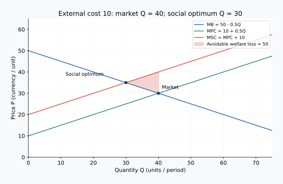

# 01｜成交双方都满意，为什么社会仍可能吃亏？

**核心问题：价格漏掉了谁的成本或收益？** 先修：供需均衡、边际比较、总剩余。核心阅读与即时题约 10–15 分钟；迁移题可以另做。所有数字为教学设定。

## 先把“影响别人”说准确

| 中文 | English | 常用缩写 | 本课解释 |
|---|---|---|---|
| 外部性 | Externality | 无通用缩写 | 一项活动影响交易之外的人，而这种影响没有得到充分补偿或收费。 |
| 私人边际成本 | Marginal Private Cost | MPC | 决策者多生产一单位自己承担的成本。 |
| 社会边际成本 | Marginal Social Cost | MSC | 多生产一单位消耗的全部社会资源，包括外部损害。 |
| 私人边际收益 | Marginal Private Benefit | MPB | 决策者多消费一单位获得的收益。 |
| 社会边际收益 | Marginal Social Benefit | MSB | 多消费一单位给所有受影响者带来的收益。 |

本课用到的旧术语（需要时展开）

| 中文 | English | 缩写或记号 | 回顾解释 |
|---|---|---|---|
| 边际成本 | Marginal Cost | `MC` | 再增加一单位行动带来的额外成本。 |
| 支付意愿 | Willingness to Pay | `WTP` | 消费者购买一单位商品最多愿意支付的金额。 |
| 正外部性 | Positive Externality | 无通用缩写 | 行为给旁观者带来未计价的收益，例如知识传播。 |

一家测试场收取自动驾驶测试费，企业愿意付钱，测试场也能赚钱。但附近居民承受噪声，却没有参与定价。这才是这里研究的负外部性。反过来，一家企业开放安全研究，使其他团队少走弯路，贡献者却不能取得全部好处，可能形成正外部性。

关键不是“行为好不好”，而是决策边界是否漏掉第三方。竞争对手降价让你的公司利润下降，通常只是通过价格发生的竞争影响；不能据此把正常竞争都视为需要矫正的外部性。已经通过赔偿完整计入决策的噪声损失，也不能再重复加一次。

## 为什么市场均衡与社会最优分开

没有外部性时，竞争市场中买方的边际支付意愿与卖方的边际资源成本相等，可以成为总剩余最大的产量。有负的生产外部性时，卖方仍只看私人边际成本，买方也没有理由主动补偿居民，于是交易有可能继续到“买卖双方还划算、社会已经不划算”的区间。

用文字项保留第三方影响，避免新造缩写：

$$
MSC=MPC+\text{边际外部损害},\qquad
MSB=MPB+\text{边际外部收益}.
$$

这些量都是“增加一单位活动”的价值，单位须一致，例如元/次。社会最优比较的是 $MSB$ 与 $MSC$；市场参与者直接比较的是 $MPB$ 与 $MPC$。常见的负生产外部性使数量偏高；常见的正消费外部性使数量偏低。这是有条件的机制判断，不是凡有污染就应该一律清零。

## 完整算一遍噪声测试场

设每天测试量为 $Q$，单位为次；需求表示边际支付意愿：$MPB=100-Q$；测试场的私人边际成本为 $MPC=20+Q$。每次测试额外给居民造成 20 元损失，且没有其他外部性，所以 $MSB=MPB$，$MSC=40+Q$。这里把次数当连续量，便于画图计算。

第一步，求未干预市场：$100-Q=20+Q$，得到 $Q=40$，价格为 60 元/次。

第二步，把居民放回账本：$100-Q=40+Q$，得到社会最优 $Q^*=30$。第 30 次测试的边际收益为 70 元，私人成本为 50 元，居民损失为 20 元，社会边际成本恰好为 70 元。

第三步，检查“少做 10 次”为什么更好。到 $Q=40$ 时，社会边际成本为 80 元，边际收益只有 60 元。第 31 至 40 次测试越往后，社会损失越大。两条直线间的三角形面积为 $\tfrac12\times10\times20=100$ 元/天，这是过度测试造成的净福利损失。40 次测试的居民总损失为 800 元，但不能把 800 元全说成可无代价消除的无谓损失，因为停止有价值的测试也会损失收益。

画图时横轴为测试次数，纵轴为元/次。需求线经过 $(0,100)$；私人成本线经过 $(0,20)$；社会成本线经过 $(0,40)$。先标私人交点 $(40,60)$，再标社会交点 $(30,70)$，就能看见差异来自哪一项。

## 反方向：有外溢收益时

假设一项培训每多举办一场，参与者自己的收益是 $80-Q$，成本是 $20+Q$，给其他团队的知识外溢收益固定为 20 元/场。市场选择 $80-Q=20+Q$，即 30 场；社会比较 $100-Q=20+Q$，得到 40 场。这里是收益曲线向上加，不是把成本曲线随意向下搬。

一个项目也可能同时有噪声损害和知识外溢，此时必须同时调整两边再比较。外部影响还可能随地点、时间、数量改变，常数 20 只是本例假设。测不到损害不等于损害为零；觉得存在损害也不等于已经知道最优减少多少。

## 配图：把推理落到坐标上

这是独立数例：MB（边际收益）=50−0.5Q，MPC（私人边际成本）=10+0.5Q，每单位外部损害10，MSC（社会边际成本）=20+0.5Q。市场产量40，社会最优30；阴影是多生产10单位造成的50元福利损失。

图中横纵轴及完整验算见[图形读法](../visual_guide.md)。

## 即时题

保持测试场的供需不变，把每次居民损失改为 10 元。求市场数量、社会最优数量，并解释二者为何不同。

展开详细答案

市场仍按 $100-Q=20+Q$ 选择 40 次，因为居民损失仍未进入私人决策。社会成本变为 $30+Q$，所以 $100-Q=30+Q$，社会最优为 35 次。市场过量 5 次；原因是边际外部损害没有计入卖方成本，而不是需求突然增加。

## 迁移题

一家企业免费发布训练数据。哪些信息能帮助你判断它有没有正外部性？“下载量很大”是否已经足够？

展开详细答案

要看第三方是否获得了未通过付款、广告交换、互惠合同等方式充分回报给发布者的额外收益，还要看隐私、误标或安全风险是否造成损害。下载量只是使用记录，不等于社会净收益。应比较发布与不发布的增量结果，识别受益者、受损者和已有补偿，避免把全部下载者收入算作外溢价值。

## 合上页面复述

用测试场解释：“市场算了买方和卖方，却漏掉了谁？少生产为什么可能增加总剩余？为什么社会最优不一定是零？”能指出遗漏项并算出 30 次，才算掌握本课。

[上一节：福利、税收与贸易复盘](../unit_04_welfare_tax_trade/08_unit_review.md) · [单元首页](README.md) · [下一节：矫正税](02_pigouvian_tax.md)

把原始答案、修正和复述卡点记入[课程工作簿](../workbook.md)。
