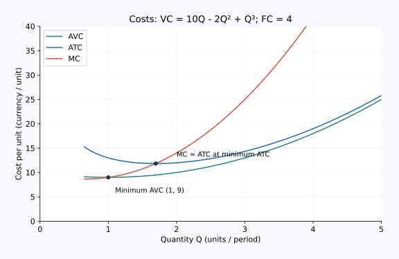

# 04｜平均成本已经很低，为什么最后一批仍可能不划算？

**核心问题：平均量描述什么，边际量决定什么？** 先修：上一课共同成本表与增量计算。核心阅读与即时题约 10–15 分钟；迁移题自选。金额为教学数据，所有成本均按同一天计。

## 本课术语

| 中文 | English | 常用缩写 | 本课解释 |
|---|---|---|---|
| 平均固定成本 | Average Fixed Cost | AFC | 固定成本分摊到每单位产出。 |
| 平均可变成本 | Average Variable Cost | AVC | 每单位产出平均承担的可变成本。 |
| 平均总成本 | Average Total Cost | ATC | 总成本除以产量。 |
| 边际成本 | Marginal Cost | MC | 再增加一单位产出的额外成本。 |
| 生产者剩余 | Producer Surplus | PS | 本课短期模型中为收入减可变成本，尚未扣除固定成本。 |

本课用到的旧术语（需要时展开）

| 中文 | English | 缩写或记号 | 回顾解释 |
|---|---|---|---|
| 曲线移动 | Shift of a Curve | 无通用缩写 | 商品自身价格以外的因素改变，使整条曲线改变位置。 |
| 经济利润 | Economic Profit | 无通用缩写 | 总收益减去显性成本与隐性成本。 |

对 $Q>0$，$AFC=FC/Q$，$AVC=VC/Q$，$ATC=TC/Q=AFC+AVC$。在零产量处不能除以零，平均成本留空，不写成零。$MC=\Delta TC/\Delta Q$；本课每一步增加一批，所以等于相邻总成本之差。

## 一张表把五个成本量连起来

沿用本期固定成本 30 元的工作室：

| $Q$，批/天 | VC，元/天 | TC，元/天 | AFC，元/批 | AVC，元/批 | ATC，元/批 | 本批 MC，元/批 |
|---:|---:|---:|---:|---:|---:|---:|
| 0 | 0 | 30 | — | — | — | — |
| 1 | 20 | 50 | 30 | 20 | 50 | 20 |
| 2 | 32 | 62 | 15 | 16 | 31 | 12 |
| 3 | 42 | 72 | 10 | 14 | 24 | 10 |
| 4 | 56 | 86 | 7.5 | 14 | 21.5 | 14 |
| 5 | 76 | 106 | 6 | 15.2 | 21.2 | 20 |
| 6 | 106 | 136 | 5 | 17.67 | 22.67 | 30 |

第四批的边际成本是 $86-72=14$ 元；四批的平均总成本是 $86/4=21.5$ 元。前者回答“从三批增加到四批多付多少”，后者回答“四批总账平均每批多少”。把两个数都叫“单件成本”而不说明口径，会直接导致经营判断错误。

## 为什么边际成本能拉动平均成本

先看熟悉的平均分：前三次考试平均 80 分，第四次得 90 分，新平均会升高；第四次得 70 分，新平均会降低。成本也是同样的算术关系。

表中从四批增加到五批，新一批边际成本 20 元，低于原平均总成本 21.5 元，因此新平均降到 21.2 元。从五批增加到六批，新一批成本 30 元，高于原平均 21.2 元，因此平均升到约 22.67 元。这里不需要先背一条曲线，就能解释平均成本的转折。

可变成本的平均也一样。第四批成本 14 元，等于前三批平均可变成本 14 元，所以做第四批后 AVC 仍为 14 元。第五批成本 20 元，高于原 AVC 14 元，所以 AVC 上升到 15.2 元。

固定成本摊薄使 AFC 随产量增加而下降，但 ATC 不会因此必然永远下降。后期新增产量越来越贵，可变成本上升会盖过固定成本摊薄。这解释了常见的 U 形平均总成本，而非要求每家企业都在所有数量范围呈标准 U 形。

## 画图时该看什么

横轴画批数，纵轴画元/批。ATC 可标关键点 $(3,24)$、$(4,21.5)$、$(5,21.2)$、$(6,22.67)$；AVC 标 $(3,14)$、$(4,14)$、$(5,15.2)$；AFC 则不断下降。ATC 与 AVC 的垂直距离就是 AFC。

连续、可微且存在内部最低点的曲线中，MC 在平均成本最低点与平均成本相等。我们的产量只能取整数，ATC 最低的第五批处是 21.2 元，而本批 MC 是 20 元，下一批 MC 是 30 元，没有哪一行必须恰好相等。应看平均成本开始由降转升的相邻选择，不能强行改数据凑交点。

## 曲线移动与沿曲线移动要分开

如果每天设备固定费用由 30 元升到 40 元，所有产量方案的总成本都增加 10 元，但相邻方案的成本差不变，所以 MC 与 AVC 不变。四批时 ATC 从 21.5 元升到 24 元，增加 $10/4=2.5$ 元；五批时增加 $10/5=2$ 元。这是成本条件改变，整条相关平均成本曲线发生变化，不是仅仅沿原曲线多生产一批。

如果每批材料费统一增加 3 元，则每批 MC 和 AVC 都增加 3 元，ATC 也增加 3 元，AFC 不变。两种涨价都可能让企业利润降低，却对新增订单的成本有不同影响。读企业公告时，先判断增加的是固定费用还是每批投入价格，才知道哪一个边际选择会受到影响。

反过来，在同样设备和工资下，把产量从四批提高到五批，只是在既有成本关系上移动。现实数据里企业扩产往往伴随设备更新，需先把产量改变与成本条件改变拆开，再讨论规模或效率。

## 生产者剩余为什么不是利润

假设单价 18 元，工作室做四批，总收益 $TR=18\times4=72$ 元，可变成本 56 元。因此生产者剩余 $PS=TR-VC=16$ 元。但还要支付 30 元固定成本，经济利润为 $\pi=TR-TC=72-86=-14$ 元。

所以在本课成本口径下，$PS=\pi+FC$。生产者剩余为正表示收入在覆盖本期可变成本后还留下部分金额，并不表示全部成本都已补偿。前面福利课计算供需图形的生产者剩余，现在需要与整家企业利润接起来。

这个关系依赖所选期间以及哪些成本属于可变、可避免。若另有开业才支付的固定启动费，简单套用本课“所有固定成本即使停产也发生”的模型会漏项，必须回到具体账本。

## 配图：把推理落到坐标上

这张连续曲线图用于对照正文的离散数表，参数独立：FC=4，VC=10Q−2Q²+Q³。AVC为平均可变成本，ATC为平均总成本，MC为边际成本；MC穿过平均曲线最低处。不能要求离散数表里也恰好存在相等的一行。

图中横纵轴及完整验算见[图形读法](../visual_guide.md)。

## 即时题

单价 22 元，工作室做五批。求总收益、生产者剩余与经济利润，并核验 $PS=\pi+FC$。

展开详细答案

$TR=22\times5=110$ 元。表中 $VC=76$ 元，$TC=106$ 元，所以 $PS=110-76=34$ 元，$\pi=110-106=4$ 元。$4+30=34$，关系成立。利润也可写为 $(P-ATC)Q=(22-21.2)\times5=4$ 元；不能把 34 元全部称为经济利润。

## 迁移题

团队长说：“多接订单就能摊薄固定成本，所以最后一批无论多贵都应该接。”用表中的第六批指出缺失的比较。

展开详细答案

第六批确实让 AFC 从 6 元降到 5 元，但它新增成本 30 元。若每批收入只有 22 元，接第六批使利润减少 8 元，ATC 也从 21.2 元升到约 22.67 元。应比较新增收入与新增成本，固定成本平均变小并不自动构成接单理由。已有固定支出不能把亏损新增订单变成有利订单。

## 合上页面复述

分别用一句话解释“平均成本”“边际成本”“生产者剩余与利润之差”，再用第六批检验自己的解释。

[上一节：固定与可变成本](03_fixed_variable_costs.md) · [单元首页](README.md) · [下一节：长期规模](05_economies_scale.md)

把原始答案、修正和复述卡点记入[课程工作簿](../workbook.md)。
