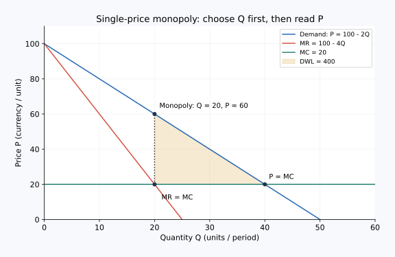

# 02｜垄断企业为什么先决定数量，再决定价格？

核心问题：**可以自己报价的企业，为什么不把价格定得无限高？** 先修：总收益、边际成本、经济利润，以及上一课的向下倾斜需求。核心学习约 10–15 分钟；公式推导可按自己的速度复读。

## 本课的词与公式记号

| 中文 | 原始英文 | 常用缩写 | 直白解释 |
|---|---|---|---|
| 总收益 | Total Revenue | TR | 全部销售带来的收入 |
| 边际收益 | Marginal Revenue | MR | 多卖一单位带来的总收益增量 |
| 边际成本 | Marginal Cost | MC | 多生产一单位带来的总成本增量 |
| 平均总成本 | Average Total Cost | ATC | 总成本除以产量 |
| 无谓损失 | Deadweight Loss | DWL | 因本可互利的交易没有发生而损失的总剩余 |

本课用到的旧术语（需要时展开）

| 中文 | English | 缩写或记号 | 回顾解释 |
|---|---|---|---|
| 经济利润 | Economic Profit | 无通用缩写 | 总收益减去显性成本与隐性成本。 |
| 固定成本 | Fixed Cost | `FC` | 不随当前产量变化的成本。 |

下文 $Q$ 表示每天销售数量，$P$ 表示元/件的价格，$TC$ 是每日总成本，$\pi$ 是每日经济利润。$Q$ 和 $\pi$ 是数学记号，不是需要背诵的英文缩写。

## 多卖一件，为什么增加的收入小于售价？

设企业对所有顾客收取同一个价格，而且需求向下倾斜。卖 3 件时，每件可收 70 元，总收入 210 元；想卖第 4 件，价格必须降到 60 元，总收入成为 240 元。多卖一件的收入增量只有 30 元。

原因有两部分：新卖的第 4 件增加 60 元，但原来的 3 件每件少收 10 元，总共损失 30 元。因此净增量为 $60-30=30$ 元。**边际收益低于价格，是统一降价影响既有销量的结果。** 如果可以只对新顾客降价，计算就变了，下一课会讨论。

当新增收益大于新增成本，扩产提高利润；反之，缩产可能提高利润。连续、可微的内点最优解通常满足 $MR=MC$，但这只是候选条件。必须检查利润函数形状、产量边界以及停产选项；不能看到交点就宣布找到最大值。

## 逐步求解一个完整模型

虚构市场的需求是 $P=100-10Q$，可行产量为 $0\leq Q\leq10$；成本是 $TC=60+20Q$。固定成本为每天 60 元，边际成本为每件 20 元。

**第一步，写收入，不把价格误当边际收益。**

$$TR=(100-10Q)Q=100Q-10Q^2$$

每增加少量产出，收入的变化率为 $MR=100-20Q$。需求线和边际收益线在纵轴上同起点，但这里后者下降更快。

**第二步，用边际条件找候选数量。**

$$100-20Q=20\quad\Rightarrow\quad Q^*=4$$

**第三步，回到需求读价格。**

$$P^*=100-10\times4=60$$

不能用 $MR=20$ 当售价；20 元是最后一小单位的净增收入。

**第四步，算总利润并验证。**

$$\pi(Q)=80Q-10Q^2-60$$

二阶变化率为 $-20$，说明这是开口向下的抛物线，内点候选为全局最大值。$Q=4$ 时收入 240 元，成本 140 元，利润 100 元。边界 $Q=0$ 时利润为 $-60$，$Q=10$ 时为 $-260$，都更差。这里停产仍承担已无法避免的固定成本；若讨论长期退出，应重新比较可避免成本。

## 把计算放回图上，检查自己有没有读错线

画图时横轴是数量，纵轴是每件金额。先在 MR 与 MC 交点读取横坐标 4，再沿竖直方向走到需求曲线，读取价格 60。需求表达顾客为该数量愿意支付多少；MR 表达改变数量带来的收入增量，两条线承担不同问题。

原例的平均总成本为 $140/4=35$ 元/件。价格与平均总成本的差额为 25，乘销量 4，正好得到利润 100 元。这个矩形用于核对总利润；价格与边际成本之间的差额 40 不能直接乘数量当总利润，否则会漏掉固定成本。若固定成本改为 200，平均总成本变为 70，高于售价 60，图上就是宽 4、高 10 的亏损矩形。

## 利润与效率是两个问题

若暂不讨论固定成本回收、只看增加交易的资源条件，令支付意愿等于边际成本：$100-10Q=20$，得到有效率的数量 8。第 5 至第 8 件附近，买方愿付的价格高于生产成本，却因统一定价下企业担心损失原有收入而没有交易。

在线性需求和恒定边际成本下，损失对应三角形，面积为 $\tfrac12(8-4)(60-20)=80$ 元/天。企业多收的钱中，一部分是消费者与企业之间的转移；只有没有实现的互利交易才形成这里的 DWL。把全部利润都称为“社会损失”是错误的。

## 边界：垄断也可能亏钱

若固定成本由 60 升为 200 元，其他条件不变，短期最佳数量仍为 4，收入 240、成本 280，利润为 $-40$。生产比停产损失 200 元更好，但长期可能退出。固定成本不改变这个例子的边际条件，却改变能否回本。如果成本不规则、有产能跳跃或需求分段，必须比较所有候选产量的总利润，单个 $MR=MC$ 交点不够。

## 配图：把推理落到坐标上

独立连续数例：需求 P=100−2Q，MR=100−4Q，MC=20。MR（边际营收）等于MC（边际成本）时Q=20，再从需求线读P=60；竞争效率基准Q=40，DWL（无谓损失）=400。此图参数与正文分开使用，重点看先Q后P的顺序。

图中横纵轴及完整验算见[图形读法](../visual_guide.md)。

## 即时题：需求提高以后

将需求改为 $P=120-10Q$，成本仍为 $60+20Q$。求最优数量、价格和利润，并说明验证依据。

展开推理答案

$TR=120Q-10Q^2$，所以 $MR=120-20Q$。与 $MC=20$ 相等得 $Q=5$，再代需求得 $P=70$。利润为 $350-(60+100)=190$ 元/天。利润函数仍为严格凹的二次函数，5 在可行区间 $[0,12]$ 内，因而是全局最优。只写“价格为 20”说明把 MR 当成 P。

## 迁移题：芯片公司为何不无限减产提价？

假设减少供应会提高芯片售价。请用本课模型解释减产可能同时降低利润的机制，并指出一种模型遗漏。

展开参考思路

提价只作用于留下的销量，少卖的单位也会失去贡献。应比较减产带来的成本节省与收入变化，不能只看单价。模型遗漏可包括长期客户转向替代芯片、产能约束、不同客户合同价格或竞争者扩产。不能把短期统一价格模型当作某家真实企业的完整预测。

## 一句话复述

“先由收入增量和成本增量找数量候选，再从需求读取价格，最后比较总利润与边界；价格、边际收益和利润率是不同的量。”

导航：[上一课](01_monopoly_market_power.md) · [单元首页](README.md) · [下一课：价格歧视](03_price_discrimination.md)

把原始答案、修正和复述卡点记入[课程工作簿](../workbook.md)。
