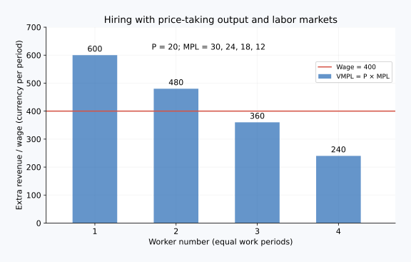

# 02｜多雇一个人，到底应该和什么比较？

核心问题：**为什么有时用“价格乘新增产量”，有时却必须计算新增收入？** 先修：派生需求、边际产量，以及 $MR$ 不一定等于价格。核心学习约 10–15 分钟，先算离散表格再看公式。

## 六个词，分成物量、金额和条件

| 中文 | 原始英文 | 常用缩写 | 本课解释 |
|---|---|---|---|
| 劳动边际产量 | Marginal Product of Labor | MPL，亦写 $MP_L$ | 多投入一单位劳动增加的实物产量 |
| 边际产量价值 | Value of the Marginal Product | VMP；劳动写 $VMP_L$ | 新增实物产量按产品价格折算的价值 |
| 边际收益产量 | Marginal Revenue Product | MRP；劳动写 $MRP_L$ 或 MRPL | 多投入一单位劳动带来的总收益增量 |
| 工资接受者 | Wage Taker | 无统一常用缩写 | 企业雇用量很小，不能影响市场工资，按给定工资雇人 |
| 边际要素成本 | Marginal Factor Cost | MFC | 多投入一单位要素引起的总要素支出增量 |
| 边际产量递减 | Diminishing Marginal Product | 无需强记统一缩写 | 其他投入固定时，继续增加一种投入，其新增产量在有关范围下降 |

$L$ 是人数或工时，$Q$ 是产量，$P$ 是产品价格，$w$ 是工资；先确定劳动单位与期间，不能用月工资去比较每日新增收入。

## 先算能够卖出多少，再算增加多少收入

假设设备固定，每名工人工作一个标准日。虚构工厂能按不受自身销量影响的价格 30 元/件卖出产品，每增加一名工人的全部相关劳动成本为 150 元/天，暂略其他随产量变化的成本。

| 工人数 $L$ | 日产量 $Q$ | 新增产量 MPL | 新增收益 $MRP_L=30\times MPL$ |
|---:|---:|---:|---:|
| 0 | 0 | — | — |
| 1 | 10 | 10 | 300 元 |
| 2 | 18 | 8 | 240 元 |
| 3 | 24 | 6 | 180 元 |
| 4 | 28 | 4 | 120 元 |

第一名增加 300 元收入、成本 150，净增 150；第二名净增 90；第三名净增 30；第四名净增 $-30$。因此雇 3 名最有利。总收益 $24\times30=720$，劳动成本 450，劳动成本后的贡献为 270 元；雇 4 名贡献只有 $840-600=240$ 元。

这里没有要求“最后一名的收益必须恰好等于工资”，因为人数是离散的。应雇到再增加一名不再提高利润；若新增收益恰好等于成本，企业在相邻选择之间可能无差异。

## 公式为什么成立，假设放在哪里？

连续、可微模型中，劳动增加先引起产量增加，再引起收益增加，因此：

$$MRP_L=\frac{dTR}{dL}=\frac{dTR}{dQ}\frac{dQ}{dL}=MR\times MPL$$

$TR$ 是 Total Revenue，即总收益；$MR$ 是 Marginal Revenue，即边际收益。链条是“每单位劳动增加多少件”乘“每多一件增加多少收入”，单位得到元/单位劳动。

产品市场完全竞争、企业接受固定价格时，$MR=P$，于是 $MRP_L=VMP_L=P\times MPL$。因此熟悉的“价格乘劳动边际产量等于工资”需要产品价格接受、工资接受、内点选择以及相关成本被完整计入等条件。一般的劳动需求依据是 MRP，而不是无条件用 P。

## 为什么不是拿平均每人的收入比较工资？

第一个表格雇 4 人时，每人平均对应收入为 $840/4=210$ 元，高于工资 150 元，但这不说明第四人应被雇用。第四人只增加 120 元收入，却花费 150 元，使总贡献下降。已有三人的较高贡献把平均数抬高了，不能拿它掩盖新增投入的低回报。

边际产量递减也不意味着后来进入的人能力更差。它描述其他投入固定时的系统变化：工位拥挤、机器排队或管理协调，使新增劳动的净效果下降。若增加设备或重新组织流程，整张产量表会变化。现实团队成员有互补性，不能机械地把表中第一人收益最高理解成“第一个入职者个人最有价值”。

## 当多卖产品必须降价时，重算一遍

保持同一产量表，改为企业面对 $P=50-Q$ 的需求，各销量对应价格不同。总收益如下：

| 工人数 | 产量 | 价格 | 总收益 | 新增一名的收益 MRP |
|---:|---:|---:|---:|---:|
| 0 | 0 | 50 | 0 | — |
| 1 | 10 | 40 | 400 | 400 |
| 2 | 18 | 32 | 576 | 176 |
| 3 | 24 | 26 | 624 | 48 |
| 4 | 28 | 22 | 616 | -8 |

每名成本仍为 150，最优雇 2 名：总收益减工资分别为 0、250、276、174、16。第 3 名新增 6 件，但新增收入只有 48 元，不能用终点价格 $26\times6=156$ 代替；增产导致前面卖出的产品也降价。

离散变动时直接用相邻总收益差最稳妥；$MR\times MPL$ 的精确微分关系对应连续小变动，不能把大跨度离散区间里的某个终点 MR 随意相乘。

## 边界：企业也未必是工资接受者

如果企业为了多招人，必须给所有现有员工一起加薪，新增一人的总工资支出增量就会高于新员工工资。例如原来 10 人各 100 元，总支出 1,000；招第 11 人要把工资提高到 110，总支出 1,210，MFC 是 210 元，而非 110 元。此时应比较 MRP 与 MFC，不能沿用 $MRP_L=w$。这种雇主市场势力常用买方垄断（Monopsony，无统一常用缩写）模型分析。

## 配图：把推理落到坐标上

这是独立离散数例：每单位产品价格20，新增员工的MPL（劳动边际产量）为30、24、18、12，所以VMPL（劳动边际产量价值）为600、480、360、240。Wage是每人同一期工资400；在图中价格接受条件下，前两人值得雇用，第三人不值得。

图中横纵轴及完整验算见[图形读法](../visual_guide.md)。

## 即时题：工资变为 200 元

在第一个固定产品价格的表格中，每名劳动成本改为 200 元，应雇几名？

展开推理答案

第 1、2 名新增收益 300、240，高于 200；第 3 名只有 180，低于 200，所以雇 2 名。贡献为 $18\times30-2\times200=140$；雇 3 名贡献 120。判断依据是增量和总利润比较，不是平均每人产量。

## 迁移题：工程师的价值能用代码行数衡量吗？

请说明代码行数为什么不能直接替代 MPL，更不能直接替代 MRP。

展开参考思路

代码行数未必代表可交付功能、可靠性或客户价值，甚至可能增加维护成本。即使正确量到新增技术产出，也要看它如何影响收入或避免成本；团队互补、长期研究、系统瓶颈还影响增量归因。这个模型可以指导提问，但不能假装精确测出每个人的贡献并据此评价人的价值。

## 复述检查

“先算新增劳动带来多少净产出，再算企业收入增加多少，最后与新增总雇用成本比较。固定产品价格和固定工资是特殊条件，拿掉条件就要换计算方式。”

导航：[上一课](01_factor_markets_derived_demand.md) · [单元首页](README.md) · [下一课：劳动者愿意工作多久](03_labor_supply_equilibrium.md)

把原始答案、修正和复述卡点记入[课程工作簿](../workbook.md)。
