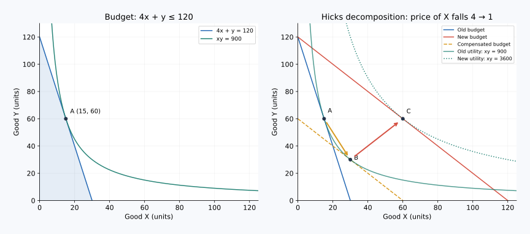

# 05｜降价后多买，究竟是哪一种力量在起作用

> 核心问题：一种商品降价，同时改变了什么？先修：[消费者最优选择](04_consumer_optimum.md)。核心学习预计 10–15 分钟；先理解三个选择点，再记效应名称。

[上一课](04_consumer_optimum.md) · [单元首页](README.md) · [下一课：劣等品与吉芬品](06_inferior_giffen.md)

## 先弄清术语

| 中文 | English | 缩写或符号 | 通俗解释 |
|---|---|---|---|
| 替代效应 | Substitution Effect | SE | 剔除特定购买能力变化后，仅因相对价格改变而调整消费。 |
| 收入效应 | Income Effect | IE | 价格变化带来的实际购买能力变化所引起的消费调整。 |
| 希克斯补偿 | Hicksian Compensation | 无通用缩写 | 调整预算，使消费者在新价格下刚好达到原来的效用水平。 |
| 正常品 | Normal Good | 无通用缩写 | 价格不变、收入增加时需求量增加的商品，适用于指定收入区间。 |
| 总效应 | Total Effect | 无统一通用缩写 | 原选择与价格变化后最终选择之间的差。 |

SE、IE 是课堂中常见记号；$A,B,C$ 只是三个消费点的名称。本课只使用希克斯分解，不把“保持旧购买组合买得起”的另一种补偿定义混入计算。

## 为什么钱包没变，也会有收入效应

假设米饭便宜了。你用原来的钱可以买更多东西，这种购买能力提高，并不需要工资真的上涨。同时，米饭相对于其他食物更便宜了，即使补走一部分钱、让满意程度停留在原水平，你也可能调整搭配。

要分开两股力量，不能只对降价前后两个点贴标签。必须人为设置一个中间点：面对新价格，但预算恰好足以维持旧效用。它是用于分析的反事实，不表示现实里一定有人先扣走你的钱。

## 用三个点把分解算完整

沿用自编效用 $U=xy$，预算 $I=120$ 元。原价格为 $p_x=4$ 元/份、$p_y=1$ 元/份。上一课已得到原最优点：

$$A=(15,60),\qquad U_A=900.$$

现在 $x$ 降至 1 元/份，$y$ 仍为 1 元/份，现金预算仍为 120 元。新预算线为 $x+y=120$，最优条件 $y/x=1$ 得到：

$$C=(60,60),\qquad U_C=3600.$$

所以 $x$ 的总变化是 $60-15=45$ 份。问题是这 45 份中，哪些来自相对价格，哪些来自购买能力？

寻找补偿中间点 B：在新价格下，花尽可能少的钱达到原效用 900。需最小化 $x+y$，同时满足 $xy\ge900$。当乘积固定为 900 时，由 $(x-y)^2\ge0$ 可得 $x+y\ge2\sqrt{xy}=60$；等号在 $x=y=30$ 成立。因此：

$$B=(30,30),\qquad I_B=60\text{ 元},\qquad U_B=900.$$

这是关键：新价格让原满意程度只需 60 元就能实现。先假想从预算扣除 60 元，消费者停在 B；随后把这 60 元恢复，消费者从 B 到 C。

| 点 | 使用价格 $(p_x,p_y)$ | 可用预算（元） | 选择 $(x,y)$ | 效用表示值 |
|---|---|---:|---|---:|
| A：原选择 | $(4,1)$ | 120 | $(15,60)$ | 900 |
| B：保持旧效用的补偿点 | $(1,1)$ | 60 | $(30,30)$ | 900 |
| C：真实新选择 | $(1,1)$ | 120 | $(60,60)$ | 3600 |

现在才命名：A 到 B 为希克斯替代效应，$x$ 增加 $30-15=15$ 份；B 到 C 为收入效应，$x$ 增加 $60-30=30$ 份。两项相加恰好为总变化 45 份。

## 怎样读图，怎样不误读

画横轴 $x$、纵轴 $y$。原预算线为 $y=120-4x$；真实新预算线为 $y=120-x$；补偿预算线为 $y=60-x$。后两条线平行，因为使用同一新价格；补偿线接触原无差异曲线，真实新线接触更高曲线。

A 与 B 的效用相同，但组合、价格、名义预算都不同。不能把“保持效用”误说成“保持购买篮子”。旧篮子 A 在新价格下花 75 元，而本课补偿预算是 60 元，两者明显不同。采用其他补偿定义也能做严谨分解，但数值可能不同；一段计算必须始终采用同一个定义。

另一个容易漏掉的发现：$y$ 的总变化是零，但其替代效应为 $30-60=-30$，收入效应为 $60-30=30$，恰好抵消。“最后没有变化”不能推出“价格变化对它毫无作用”。

## 模型边界与证据要求

本例价格由外部给定，收入、偏好、两种商品定义均保持稳定，且假设选择遵循这套偏好。现实中看到降价后销量增加，可能还同时有促销曝光、产品质量变化、用户增加，不能只凭一张销量表估计两种效应。收入效应也不是“收入曲线移动”的口号，而是在固定新价格下，比较两个预算水平带来的选择变化。

## 配图：把推理落到坐标上

与本课相同的三个点：A=(15,60)、B=(30,30)、C=(60,60)。左图是原预算与旧效用；右图虚线为按新价格保持旧效用的补偿预算。A到B的X增加15是希克斯替代效应，B到C再增30是收入效应，总增加45。

图中横纵轴及完整验算见[图形读法](../visual_guide.md)。

## 即时题：追踪另一种商品

用上表写出 $y$ 的替代效应、收入效应、总效应，并解释为什么原始与最终 $y$ 一样多。

展开推理答案

SE 为 $30-60=-30$ 份，IE 为 $60-30=30$ 份，总效应为 0。$x$ 相对便宜导致替代掉一部分 $y$；购买能力提升又增加 $y$。本例中两者数量相等，这是特定偏好和参数下的结果，不是所有降价情形的通则。

## 迁移题：工资上涨能叫替代效应吗

食物价格都没变，一个人的现金收入从 3,000 元增至 3,500 元，食物搭配改变。能否照搬 A→B→C，把其中一段称为由食物相对价格改变引起的替代效应？

展开推理答案

不能。单看两种食物，价格比没有变，这次变化是现金收入变化引起的需求反应，没有本课价格分解中的相对价格变化。若同时研究劳动与闲暇，工资本身又是闲暇的机会成本，才需要在那个不同模型里分析替代与收入效应。必须先说清选择对象。

复述要求：不用翻书写出 A、B、C，指出哪两点保持效用、哪两点保持价格，再完成 $45=15+30$。仅背定义还不足以解释分解。

把原始答案、修正和复述卡点记入[课程工作簿](../workbook.md)。
